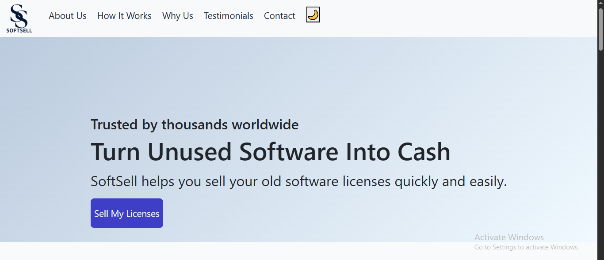

# 💼 SoftSell Website

Welcome to the **SoftSell Website** – a clean, responsive, and modern web page designed to showcase a product or service effectively. This project demonstrates a user-friendly layout with smooth navigation, a clear explanation of how the product works, trust-building testimonials, and a contact form for lead generation.

🌐 **Live Site:** [https://techieshruti.github.io/SoftSell_Website/](https://techieshruti.github.io/SoftSell_Website/)

---

## 📌 About the Project

The **SoftSell Website** is ideal for showcasing SaaS, startup tools, or software services. It has been built using HTML, CSS, JavaScript, and Bootstrap. The site is fully responsive and optimized for all screen sizes.

This website includes the following major sections:

- **Hero Section:** Catchy headline and subheading to attract visitors.
- **How It Works:** Step-by-step explanation of how the product/service functions.
- **Why Choose Us:** Highlights benefits and unique selling points.
- **Customer Testimonials:** Carousel showcasing user reviews to build credibility.
- **Contact Form:** Allows visitors to get in touch or inquire.

---

## 🎯 Features

- ✅ Fully responsive layout
- ✅ Fixed top navigation bar with smooth scrolling
- ✅ Bootstrap-based layout for fast development
- ✅ Clean UI and modern design
- ✅ Simple, well-organized codebase for easy editing
- ✅ Ready for GitHub Pages deployment

---

## 🛠️ Technologies Used

- **HTML5** – structure and content
- **CSS3** – styling and layout
- **JavaScript (Vanilla)** – basic interactivity
- **Bootstrap 5** – grid, components, and responsive behavior

---

## 🧰 Installation & Setup

To run this project locally:

1. Clone the repository:
   ```bash
   git clone https://github.com/techieshruti/SoftSell_Website.git
   ```

2. Open the folder:
   ```bash
   cd SoftSell_Website
   ```

3. Open `index.html` in your browser.

No build tools or package managers are needed!

---

## 📸 Screenshots



---

## 🚀 Deployment

This project is deployed on GitHub Pages.

---

## 👩‍💻 Author

**Shruti** – [@techieshruti](https://github.com/techieshruti)

---

## 📄 License

This project is open-source and free to use. You can modify and use it for personal or commercial purposes.

---

## 📬 Feedback

If you have any feedback or suggestions, feel free to create an issue or contact me on GitHub.
